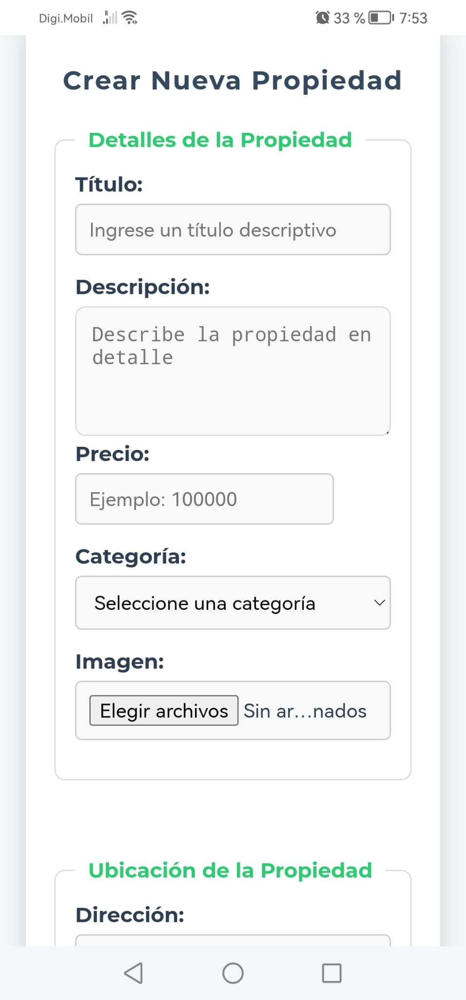

# 🏡 Delamaison

    

Es una plataforma web responsiva desarrollada con HTML, CSS, JavaScript, PHP, y una base de datos relacional MySQL. Diseñada específicamente para el mercado colombiano, permite a los propietarios publicar anuncios de propiedades en alquiler y a los interesados consultar opciones disponibles, todo desde la comodidad de sus dispositivos.

El propósito principal de Delamaison es facilitar el acceso a opciones de alquiler, eliminando la necesidad de desplazarse físicamente para buscar propiedades. Sin embargo, la plataforma no verifica la autenticidad de las publicaciones ni se involucra en las transacciones entre las partes.

## 🌟 Funcionalidades Principales

### Características Actuales

- **Publicación de Propiedades**: 
  Los propietarios pueden crear anuncios detallados que incluyen información como ubicación, precio, descripción y características específicas de la propiedad.

- **Galería de Imágenes**: 
  Los anuncios permiten adjuntar múltiples fotos para mejorar la visualización y comprensión de las propiedades.

- **Exploración Eficiente**: 
  Los usuarios pueden buscar propiedades filtrando por categorías como apartamentos, casas, locales comerciales y estudios.

- **Conexión Directa**: 
  Cada anuncio incluye información de contacto para facilitar la comunicación directa entre propietarios e interesados.

- **Diseño Responsivo y Amigable**: 
  La interfaz se adapta a dispositivos móviles, tablets y computadoras, ofreciendo una experiencia de usuario optimizada.

## ⚙️ Estructura del Proyecto

### 1. Frontend:
- **HTML y CSS**: Proporcionan la estructura y estilo visual de la plataforma.
- **Diseño Responsivo**: Compatible con dispositivos móviles y de escritorio para facilitar la navegación desde cualquier lugar.

### 2. Backend:
- **JavaScript**: Manejo de interacciones dinámicas en la interfaz de usuario.
- **PHP**: Gestión de la lógica del servidor y comunicación con la base de datos.
- **Base de Datos MySQL**: Almacena información de usuarios, propiedades y sus características asociadas.

### 3. Gestión de Datos:
- Funciones para insertar, editar y visualizar anuncios, garantizando una interacción fluida entre el frontend y el backend.

## 🔎 Ejemplos de Uso

- Un propietario puede crear un anuncio de su propiedad desde cualquier dispositivo, especificando detalles como precio, ubicación y características clave.
- Una persona interesada puede explorar propiedades en alquiler desde su hogar, ahorrando tiempo y esfuerzo al contactar directamente a los propietarios.
- La plataforma elimina la necesidad de desplazamientos innecesarios, permitiendo una búsqueda eficiente desde cualquier lugar.

## 💻 Requisitos

### Para el Entorno de Desarrollo
- **Frontend**: Navegador web moderno (Chrome, Firefox, Edge, etc.).
- **Backend**: Servidor local como XAMPP, WAMP, o Laragon.
- **Base de datos MySQL** configurada.
- **Herramientas de Desarrollo**: Editor de código como Visual Studio Code, Sublime Text, o similar.
- **Cliente MySQL**: phpMyAdmin o herramientas de administración equivalentes.

### Para el Usuario Final
- **Conexión a Internet**: Requerida para acceder a la plataforma.
- **Dispositivo con Navegador Web**: Compatible con cualquier navegador actualizado.

## 📷 Capturas de Pantalla

    
    

## 💡 Funcionalidades Futuras

### Mejoras Planificadas

- **Favoritos**: Los usuarios podrán guardar propiedades en una lista personalizada para consultarlas más tarde.
- **Sistema de Reportes**: Incorporación de un sistema para reportar anuncios sospechosos o con información incorrecta.
- **Geolocalización**: Visualización de propiedades en un mapa interactivo para facilitar la búsqueda por ubicación.
- **Multilenguaje**: Soporte para español e inglés, ampliando el alcance de la plataforma.
- **Filtrado Avanzado**: Inclusión de filtros como número de habitaciones, baños, área total y rango de precios.
